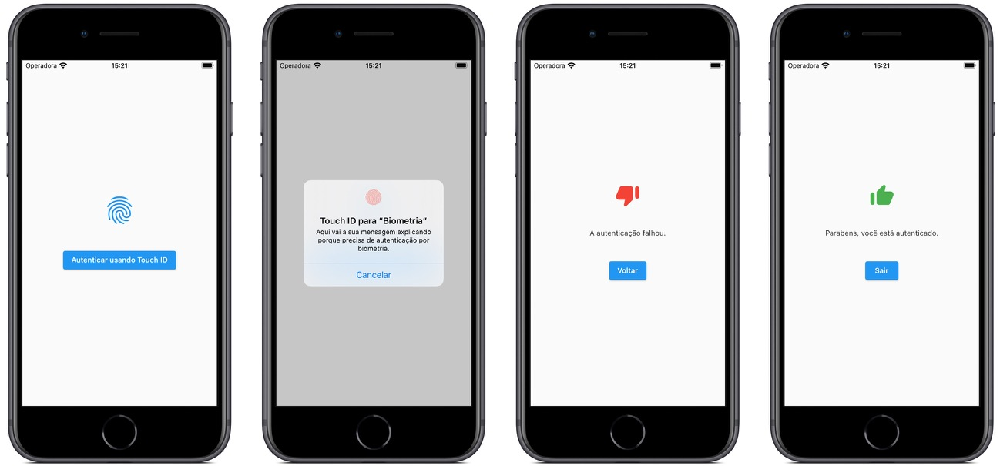
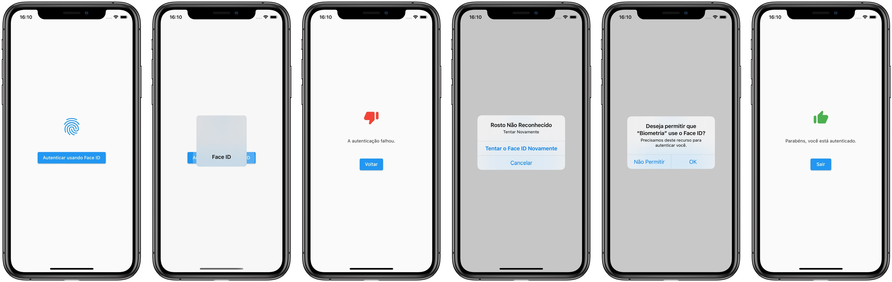
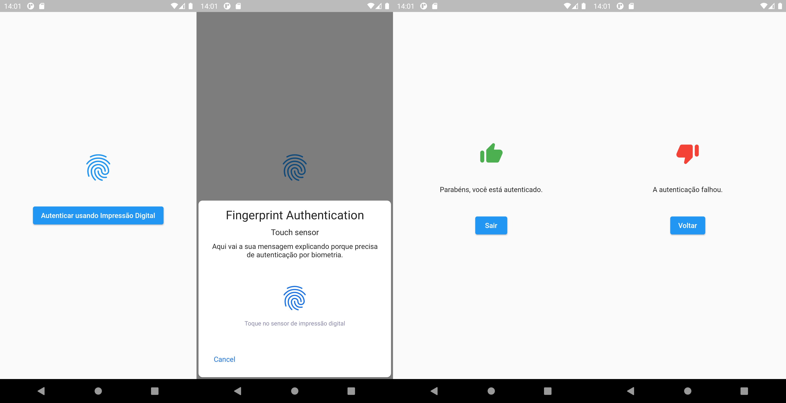

# Exemplo de Uso de Biometria com Flutter

Exemplifica como utilizar a package [local_auth](https://pub.dev/packages/local_auth) para habilitar o uso de biometria em aplicações [Flutter](https://flutter.dev).

# Uso

Para utilizar, instale a package [local_auth](https://pub.dev/packages/local_auth) no arquivo pubspec.yaml.

No iOS, habilite o uso do FaceID, incluindo a linha abaixo no arquivo [`Info.plist`](./ios/Runner/Info.plist)`:

```plist
<key>NSFaceIDUsageDescription</key>
<string>Precisamos deste recurso para autenticar você.</string>
```

No Android, habilite o uso de biometria, inclindo a linha abaixo no arquivo [`AndroidManifest.xml`](./android/app/src/main/AndroidManifest.xml).

```xml
<uses-permission android:name="android.permission.USE_FINGERPRINT"/>
```

Também altere a classe `FlutterActivity` pela classe `FlutterFragmentActivity` no arquivo [`MainActivity.kt`](./android/app/src/main/kotlin/io/github/ivanwhm/flutter_biometrics/MainActivity.kt).

# Telas

## TouchID (iOS)



## FaceID (iOS)



## Impressão Digital (Android)



Feito com &hearts; por Ivan Wilhelm.

Codificado no [Visual Studio Code](https://code.visualstudio.com) da [Microsoft](https://www.microsoft.com.br)
